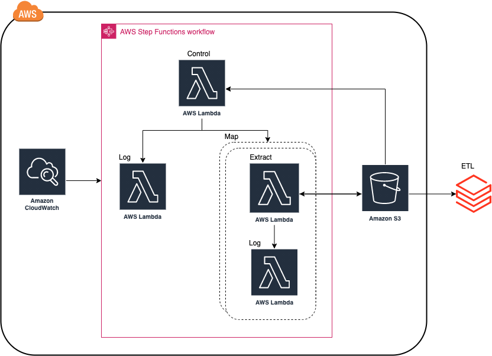

## PICPAY CRAWLER EXTERNAL DATA

Esse pacote tem o intuito de extrair dados de diversas fontes externas.

### Arquitetura

A arquitetura é formada por dois aws lambdas e orquestrada pelo aws step function 
O lambda control faz o controle dos dados que serão extraídos e o lambda extract faz a extração dos dados baseado nos parâmtros recebidos do control.



### Nova extração

Para adicionar um novo script de extração é preciso criar um arquivo .py no seguinte path 

`functions/crawler/external_data/<nom_pasta_extração>/<nome_script_extração>.py`

Esse script conterá toda lógica da extração e por obrigatoriedade essa lógica deve estar em uma função com nome extract como no exemplo abaixo

`def extract(**params):`

Para que esse novo script de extração seja acessivel ao projeto devemos criar uma nova entrada no arquivo yaml do control,
esse arquivo pode ser encontrado no s3 e é referenciado pelas variáveis de ambiente do lambda. O arquivo do control tem 
a seguinte estrutura

```
- name: <nome_do_que_esta_sendo_extraido>
  file: <nome_do_script_de_extração>
  folder: <nome_da_pasta_onde_está_o_script_de_extração>
  params: 
     # Parametros que serão passados para a função extract
```

Um exemplo 

```
- name: selic
  file: historic_serie
  folder: bacen
  params: 
    url: https://www3.bcb.gov.br/sgspub/consultarvalores/consultarValoresSeries.do?method=consultarValores
    series: 11
    start_date: 1900-01-01
```

Por padrão o start_date do params é atualizado para a data mais recente após rodar a primeira consulta.

### Upload para aws

Para fazer o upload do projeto para a aws é usado o aws sam. Abaixo é mostrado um exemplo de como fazer o upload

`sam build`

`sam package --s3-bucket picpay-datalake-sandbox --s3-prefix leonardocastro/deploy --output-template-file out.yml --region us-east-1`

`sam deploy --template-file out.yml --stack-name picpay-crawler-external-data --region us-east-1 --no-fail-on-empty-changeset --capabilities CAPABILITY_IAM CAPABILITY_NAMED_IAM`

